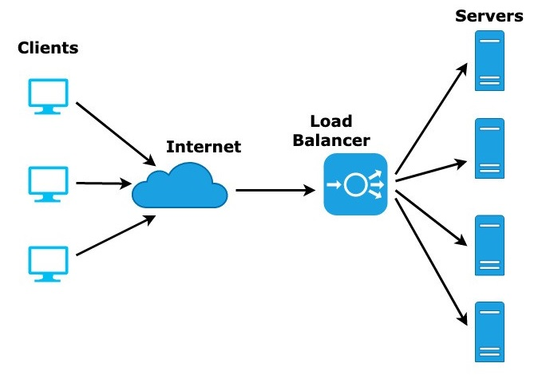
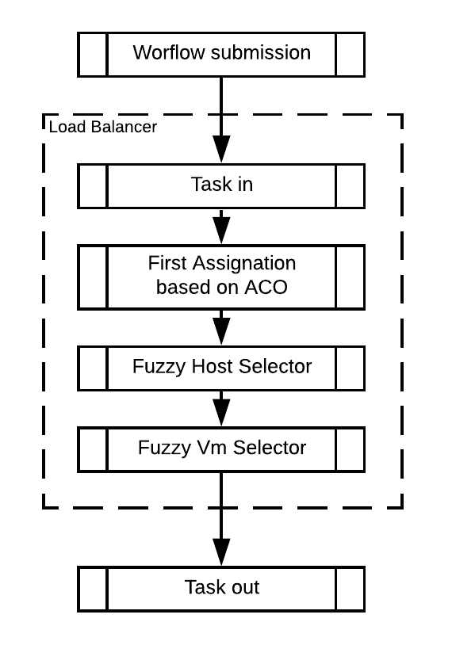

Fuzzy Logic based Load Balancer
================
Andres Fernando Garcia
3/6/2021

## Projects details

The present project consists of a [load
balancer](https://en.wikipedia.org/wiki/Load_balancing_\(computing\))
based on the Artificial Bee Colony
([ABC](https://en.wikipedia.org/wiki/Artificial_bee_colony_algorithm))
algorithm and Fuzzy Logic. The project is programmed in Java using the
[CloudSim](http://www.cloudbus.org/cloudsim/doc/api/overview-summary.html)
framework, in its version 3.0.3. In the first instance, the
[cloudlets’](https://en.wikipedia.org/wiki/Cloudlet#:~:text=A%20cloudlet%20is%20a%20mobility,mobile%20devices%20with%20lower%20latency.)
tasks are assigned to a Virtual Machine (VM) according to the ABC
algorithm. After that, tasks are reassigned using Fuzzy Logic blocks to
select the best Host and VM. This project pretends to analyze if this
approach improves some Quality of service
([QoS](https://en.wikipedia.org/wiki/Quality_of_service)) parameters as
Degree of Imbalance, Response Time, Cost, and so on. All QoS parameters
mentioned in the present work are shown in the article: *[“Honey bee
behavior inspired load balancing of tasks in cloud computing
environments”](http://www.ttcenter.ir/ArticleFiles/ENARTICLE/3132.pdf)*.

The parameters of the Fuzzy Host Selector are Capacity, Host Load, and
Host Response Time. The parameters of Fuzzy VM Selector are Consumed
Power, VM Cost, and VM Execution Time. The fuzzy blocks were programmed
using the
[jFuzzyLogic](http://jfuzzylogic.sourceforge.net/html/java.html)
library. The Fuzzy blocks code are in the file ./Main files from the java project/DatacenterBroker.java, in the fuzzy_system function.

## Results and discusion

In this section a comparison between three different approaches for load
balancing is made. The three algorithms taken in count are: *honey bee
behavior inspired load balancing* (HBB-LB, proposed in the article
previously mentioned), *Load Balancing Algorithm based on Honeybee
behavior* (LBA-HB) and the proposed *Improved LBA-HB* (ILBA-HB). For
more details refer to
[this](http://www.warse.org/IJATCSE/static/pdf/file/ijatcse841022021.pdf)
document. The simulation with the CloudSim framework follow the next
steps:

1.  Initialize the CloudSim package
2.  Create Datacenters
3.  Create Broker
4.  Create VMs and Cloudlets and send them to broker
5.  Starts the simulation
6.  Save results when simulation is over

The results of each algorithm are visually summarized using boxplots and
tables with the statistics of they. The first response to be analyzed is
the Response Time (RT). This measure is important to analyze for a VM
which determine the readiness of VM to accept the tasks. The next figure
shows the box plots representing the distribution of results for RT. The
statistics values for these distributions are in the table 1.

|  Stat   | HBB-LB | LBA-HB | ILBA-HB |
| :-----: | :----: | :----: | :-----: |
|  Min.   |  6.36  |  1.46  |  1.396  |
| 1st Qu. | 19.08  | 14.96  | 14.432  |
| Median  | 64.28  | 36.70  | 34.922  |
|  Mean   | 97.40  | 46.32  | 44.513  |
| 3rd Qu. | 148.78 | 68.17  | 64.663  |
|  Max.   | 409.40 | 155.65 | 152.632 |

Table 1: Statistics for RT of HBB-LB, LBA-HB, ILBA-HB algorithms

The next response to be analyzed is the Degree of Imbalance (DI). The DI
is the imbalancing rate of the VM depending on the imbalance in the VM
load. The distribution and statistics of this measure are shown on the
next figure and table 2.

|  Stat   | HBB-LB | LBA-HB | ILBA-HB |
| :-----: | :----: | :----: | :-----: |
|  Min.   | 1.414  | 1.205  |  0.703  |
| 1st Qu. | 1.415  | 1.272  |  1.217  |
| Median  | 2.772  | 1.301  |  1.265  |
|  Mean   | 2.700  | 1.297  |  1.352  |
| 3rd Qu. | 3.921  | 1.314  |  1.387  |
|  Max.   | 4.497  | 1.370  |  2.458  |

Table 2: Statistics for DI of HBB-LB, LBA-HB, ILBA-HB algorithms

The last response to be analyzed is the Makespan. This measure indicate
the completion time of a VM, generally it includes all the hold
time/wait time of the VM. The next figure indicates the distribution of
results for Makespan and the table 3 the statistics these distributions.

|  Stat   | HBB-LB | LBA-HB | ILBA-HB |
| :-----: | :----: | :----: | :-----: |
|  Min.   |  12.0  |  3.00  |  2.00   |
| 1st Qu. |  36.0  | 27.00  |  24.00  |
| Median  | 202.0  | 64.00  |  64.72  |
|  Mean   | 372.6  | 80.85  |  77.98  |
| 3rd Qu. | 604.1  | 117.74 | 109.75  |
|  Max.   | 1714.5 | 269.99 | 259.99  |

Table 3: Statistics for Makespan of HBB-LB, LBA-HB, ILBA-HB algorithms

After have a overview of the data distribution, the next test to be done
will be the correlation between all responses. How the Response Time
(RT), Degree of Imbalance (DI) and Makespan comes from the same
experiments is useful to know if there are any association between those
features. This test is performed graphically with the scatter-plot of
the next figure, and numerically computing the Spearman’s rank
correlation coefficients on the table 4.

|          |   RT |   DI | Makespan |
| :------- | ---: | ---: | -------: |
| RT       | 1.00 | 0.34 |     0.99 |
| DI       | 0.34 | 1.00 |     0.44 |
| Makespan | 0.99 | 0.44 |     1.00 |

Table 4: Spearman’s rank correlation coefficient

With this test it can be concluded that the RT and Makespan responses
are highly associate due the linearity of its graph and because its
correlation coefficient is practically 1.

To perform the comparison it is necessary to take the same reference on
measures like Response Time and Makespan. This is necessary because
variations in the number of clouds or their lengths weight highly in the
responses. The follow images shows with more details the need of to have
the same reference on the experiments.

How the measures have that increasing behavior they can not directly
compared, it is necessary a new reference that minimize this behavior.
The new reference for Makespan and Response time will be a cloudlet with
2000 tasks and 100 MI of length, that it is the smaller cloudlet on the
experiments. For adjust the data to this new reference it is necessary
divide the corresponding measure to the number of tasks and length of
it:

Measure = Measure x 2000 x 100 / (Tasks x Length)

Where the Measure can be RT or Makespan because DI don’t need this
adjustment. Performing the adjustment the data results with the
dispersion showed on the next figure.

As can be seen, after the adjustment, the data don’t have an high
increasing trend as in the first images. Now, all measures can be
compared with a reduced influence of the number of tasks or their
length.

To perform the comparison between measures it is necessary to check the
normality of the data. If the data have a normal behavior, a ANOVA test
will be done. However, ff the data don’t have a normal behavior, a
Kruskal-Wallis test will be done instead. The normality is visually
checked with Quantile-Quantile plots. How Makespan have a highly
correlation with the RT its plot was omitted on the next figure that
correspond to the Q-Q plots.

This plot shows that the data don’t follow a normal distribution. Thus,
the selected hypothesis test is the Kruskal-Wallis test. The null and
alternative hypothesis for this test are:

  - H\_0: All medians are equal
  - H\_1: At least one median is different

The test gave these results:

| Statistic                 | RT        | DI        | Makespan  |
| :------------------------ | :-------- | :-------- | :-------- |
| p-value                   | \<2.2e-16 | \<2.2e-16 | \<2.2e-16 |
| Kruskal-Wallischi-squared | 92.485    | 159.98    | 82.445    |

Table 5: Results of the kruskal test

How all p-values are less than 0.05 it is possible to conclude that all
measures are statistically different between algorithms. Now, a pairwise
comparison between the algorithms, using the Wilcoxon signed-rank test,
will be done. The null and alternative hypothesis are:

  - H\_0: 1st algoritm \>= 2nd algoritm  
  - H\_1: 1st algoritm \< 2nd algoritm

The first result to be analysed is the RT. The results for this test are
showed on the table 6.

| V1      | V2        | V3      |
| :------ | :-------- | :------ |
|         | HBB-LB    | ILBA-HB |
| ILBA-HB | \=1.6e-10 | \-      |
| LBA-HB  | \=1.6e-10 | 1.00    |

Table 6: Results of the Wilcoxon signed-rank test for RT

The 1st algorithm correspond to the first columns and the 2nd algoritm
to the header row on the null and alternative hypothesis previously
defined. With this results it is possible to conclude that the RT for
the ILBA-HB algorithm is statistically smaller than the other
algorithms. How makespan reposes have high correlation with RT, they are
expected to have a high similarity on the results of this test.

| V1      | V2        | V3      |
| :------ | :-------- | :------ |
|         | HBB-LB    | ILBA-HB |
| ILBA-HB | \=1.4e-10 | \-      |
| LBA-HB  | \=2.6e-10 | 1.00    |

Table 7: Results of the Wilcoxon signed-rank test for Makespan

And again it is possible to conclude that the Makespan for the ILBA-HB
algorithm is statistically smaller than the other algorithms. Finally,
the last test consider the DI is done:

| V1      | V2      | V3      |
| :------ | :------ | :------ |
|         | HBB-LB  | ILBA-HB |
| ILBA-HB | \=2e-16 | \-      |
| LBA-HB  | \=2e-16 | 0.78    |

Table 8: Table 8: Results of the Wilcoxon signed-rank test for DI

With this result it is possible to conclude that the DI for the ILBA-HB
algorithm is statistically smaller than the other algorithms.

Now tests will be done with the perspective of a VM. The follow
hypotheses test will prove if there are a significant difference on the
power consumption between VMs with improved QoS values and VMs with
normal QoS values. For this test a Cloudlet always utilize all the
available CPU and RAM capacity. The power consumption model is based on
a 4Gb DDR4 ram and a intel core i3 processor. 2 algorithm are taking on
count: LBA-HB and ILBA-HB. The ILBA-HB algorithm works improving the
load, execution time (resulting time), power consumed and cost of LBA-HB
algorithm. In brief, the ILBA-HB algorithm use the previously mentioned
parameters to reassign the VMs to the Cloudlets and thus improve the DI.
First, a boxplot will be done for look the dispersion of the power
consumed by VMs of both algorithms. That graph can be seen on the next
igure, and its statistics on the table 9.

| V1      | LBA-HB | ILBA-HB |
| :------ | -----: | ------: |
| Min.    |  0.380 |   0.010 |
| 1st Qu. |  0.988 |   0.711 |
| Median  |  1.687 |   1.450 |
| Mean    |  2.670 |   2.345 |
| 3rd Qu. |  2.862 |   2.778 |
| Max.    | 15.150 |  20.200 |

Table 9: Dispersion of the power consumed by VMs

How there are a lo of outliers on the boxplots is easy to conclude that
the distribution does not follow a normal behavior. So, a Wilcoxon rank
sum test will prove if there are significant changes on power
consumption for both algorithms. The p-value for this test results on:

p-value = 0.6128

How the p-value is greater that 0.05 there is no way to reject the null
hypothesis. Therefore, there is not statistical evidence to say that the
power consumption between both algorithms are different.
